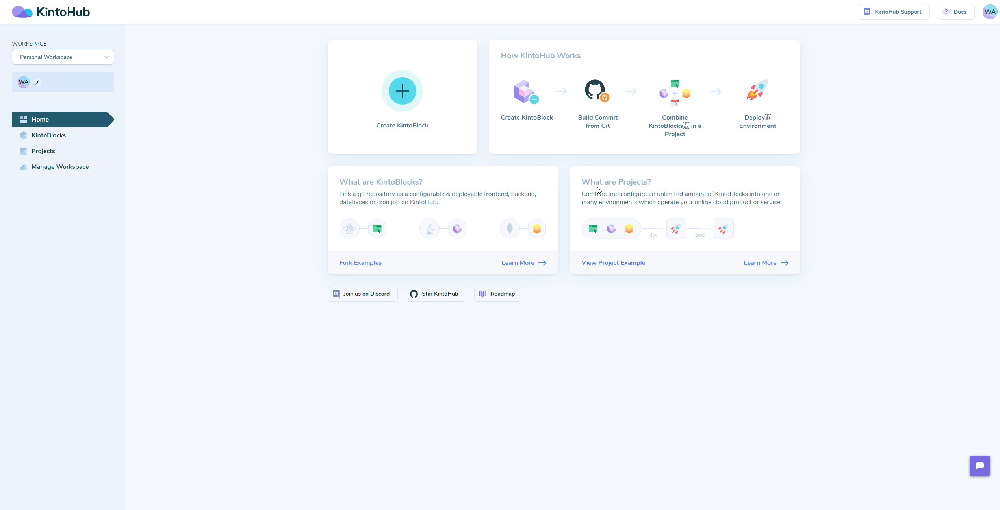

# [KintoHub](https://www.kintohub.com)  
 

 

We build online tools to make developers’ lives easier. You code microservices - we take care of hosting, infra, CI / CD, discovery, compatibility, documentation and dependencies.

<a href="https://www.kintohub.com">Learn More</a> · <a href="https://blog.kintohub.com/">Blog</a> · <a href="https://www.kintohub.com/company">About Us</a> · <a href="https://www.kintohub.com/contact-us">Contact Us</a>

## Table of Contents

- [Overview](#overview)
- [Contribute](#contribute)
- [Community](#community)
- [Example Projects](#example-projects)

## Overview

KintoHub's goal is to create a community of developers building and sharing microservices.  Here any feature requests, bugs and enhancements should be logged. We will share our roadmap and priorities alongside tasks that can be picked up to help each other out!

## Contribute
Got a bug or a feature request? Please [open a new issue](https://github.com/kintohub/kintohub-docs/issues/new).

## Release Status & Notes
We're currently in Open Beta.

For people participating in our beta, you may find the release notes [here](https://feedback.kintohub.com/changelog).

## Features

* Github Account Connection
* Workspaces for Collaboration
* Multi-Language Support
  * csharp (gRPC Tested, HTTP not tested)
  * golang (http tested, grpc not tested)
  * java (http tested, grpc not tested)
  * nodejs (http tested, grpc not tested)
  * python (http tested, grpc not tested)
  * ruby (committed - coming soon)
  * c++ (committed - coming soon)
  * php (committed - coming soon)
  * swift (commited - coming soon)
  * [Please request more](https://github.com/kintohub/kintohub-docs/issues/new).
* Microservice project management
  * Configuration (In Development)
  * Enviornment Variables (Proof of Concept)
  * Adding Dependencies (Proof of Concept)
  * Branch + Tag Management
  * Automated Documentation Generation
  * Team Management (Proof of concept)
* Deployable Application Management
  * Add Microservice Dependencies
  * Release management via Tags
  * Multi-environments
  * Edit Configuration per environment (committed - coming soon)
  * Team Management (proof of concept)
  * Serverless Hosted Deployments
* Experimental Features
  * Magic Headers (Docs soon)
  * Config via Headers (Docs Soons)

## Community

Get updates on our platform development and chat with our staff and community members:

- Follow [@KintoHub on Twitter](https://twitter.com/kintohub)
- Read and follow [our blog on Medium](https://blog.kintohub.com)
- Chat on [our Discord Server](https://discord.gg/TMfrYDK)

## Example Projects

| Example Type |
|:-------------|
| **[Express](https://docs.kintohub.com/docs/examples/nodejs/express)** |
| **[Koa](https://docs.kintohub.com/docs/examples/nodejs/koa)** |
| **[Fastify](https://docs.kintohub.com/docs/examples/nodejs/fastify)** |
| **[Hapi](https://docs.kintohub.com/docs/examples/nodejs/hapi)** |
| **[FastHttp](https://docs.kintohub.com/docs/examples/go/fasthttp)** |
| **[Gin](https://docs.kintohub.com/docs/examples/go/gin)** |
| **[Iris](https://docs.kintohub.com/docs/examples/go/iris)** |
| **[Beego](https://docs.kintohub.com/docs/examples/go/beego)** |
| **[Flask](https://docs.kintohub.com/docs/examples/python/flask)** |
| **[Django](https://docs.kintohub.com/docs/examples/python/django)** |
| **[Serve Static Files](https://docs.kintohub.com/docs/examples/static-website/tutorial)** |
| **[Static HTML Website](https://docs.kintohub.com/docs/examples/static-website/static)** |
| **[Ionic PWA](https://docs.kintohub.com/docs/examples/ionic/tutorial)** |
| **[Docusaurus](https://docs.kintohub.com/docs/examples/docusaurus/tutorial)** |
| **[Jekyll](https://docs.kintohub.com/docs/examples/static-website/jekyll)** |
| **[Angular](https://docs.kintohub.com/docs/examples/static-website/angular)** |
| **[React](https://docs.kintohub.com/docs/examples/static-website/react)** |
| **[Preact PWA](https://docs.kintohub.com/docs/examples/static-website/preact)** |
| **[Vue](https://docs.kintohub.com/docs/examples/static-website/vue)** |
| **[NextJs](https://docs.kintohub.com/docs/examples/static-website/nextjs)** |
| **[Puppeteer](https://docs.kintohub.com/docs/examples/jobs/puppeteer)** |
| **[Hasura](https://docs.kintohub.com/docs/examples/hasura/tutorial)** |
| **[Todo List](https://docs.kintohub.com/docs/examples/todo-list/tutorial)** |
