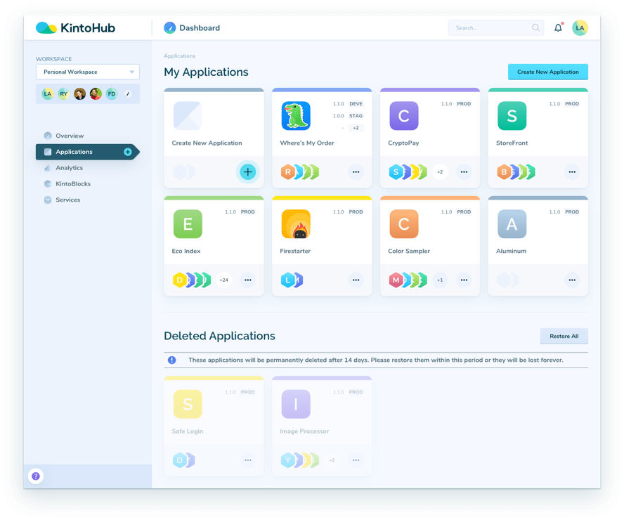

# [KintoHub](https://www.kintohub.com) [](https://www.kintohub.com) [](https://www.twitter.com/kintohub)
<br/>




<br/>

We build online tools to make developers’ lives easier. You code microservices - we take care of hosting, infra, CI / CD, discovery, compatibility, documentation and dependencies.

<p><a href="https://www.kintohub.com">Learn More</a> · <a href="https://www.kintohub.com/faqs/">FAQs</a> · <a href="https://blog.kintohub.com">Blog</a> · <a href="https://www.kintohub.com/aboutus/">About Us</a> · <a href="https://www.kintohub.com/contactus/">Contact Us</a></p>


## Table of Contents

- [Overview](#overview)
- [Contribute](#contribute)
- [Community](#community)
- [Getting Started](#getting-started)
- [Example Projects](#example-projects)


## Overview

KintoHub's goal is to create a community of developers building and sharing microservices.  Here any feature requests, bugs and enhancements should be logged. We will share our roadmap and priorities alongside tasks that can be picked up to help each other out!


## Contribute
Got a bug or a feature request? Please [open a new issue](https://github.com/kintohub/kintohub-docs/issues/new).

## Release Status & Notes
We're currently in "Private Alpha".  We will open a public Alpha release soon.  Our Alpha phase will have massive changes, but we have a fair amount of features we've built.  We expect to have a stable Beta offering by October 2018.

For people participating in our alpha, you may find the release notes [here](release-notes/Alpha.md).

## Features

* Github Account Connection
* Workspaces for Collaboration
* Multi-Language Support
  * csharp (gRPC Tested, HTTP not tested)
  * golang (http tested, grpc not tested)
  * java (http tested, grpc not tested)
  * nodejs (http tested, grpc not tested)
  * python (http tested, grpc not tested)
  * ruby (committed - coming soon)
  * c++ (committed - coming soon)
  * php (committed - coming soon)
  * swift (commited - coming soon)
  * [Please request more](https://github.com/kintohub/kintohub-docs/issues/new).
* Microservice project management
  * Configuration (In Development)
  * Enviornment Variables (Proof of Concept)
  * Adding Dependencies (Proof of Concept)
  * Branch + Tag Management
  * Automated Documentation Generation
  * Team Management (Proof of concept)
* Deployable Application Management
  * Add Microservice Dependencies
  * Release management via Tags
  * Multi-environments
  * Edit Configuration per environment (committed - coming soon)
  * Team Management (proof of concept)
  * Serverless Hosted Deployments
* Experimental Features
  * Magic Headers (Docs soon)
  * Config via Headers (Docs Soons)

## Community

Get updates on our platform development and chat with our staff and community members:

- Follow [@KintoHub on Twitter](https://twitter.com/kintohub)
- Read and follow [our blog on Medium](https://blog.kintohub.com)
- Chat on [our Slack channel](https://join.slack.com/t/kintohub/shared_invite/enQtMzIxNDU2OTE4NTYyLWJmNWM1ZTQ3YTFlMzJkYWUzMWE2ZTlmZjk3ZGQ1NWFlMDRkYzhhODNmNDZlMDZmNjhlMzBhNWRiYWIxMTVjMmU)
- Join the discussions on [Discourse](https://community.kintohub.com)


## Getting Started


This start-to-finish guide will walk you through creating a first microservice from scratch and getting it up and running on KintoHub. It should take you about 15-30min. Have fun!  We're looking for feedback on our getting started, so do [open a new issue](https://github.com/kintohub/kintohub-docs/issues/new) if you find something!

#### Getting your code ready for KintoHub - overview

Preparing your code to have it effortlessly work on KintoHub is very straightforward - here is a high-level of what it entails:

1. Your code must be on GitHub
2. Your code must have `Dockerfile`
    - the command used to run the production version must be exposed in `Dockerfile` using `EXPOSE`
3. The service must be listening to port `80` for production
4. Your code must be documented with our version of apidoc ([detailed here](https://docs.kintohub.com/docs/apidoc.html))


> if you have to specify a hostname for the framework/library that you are using, please  use 0.0.0.0. localhost and note that 127.0.0.1 won't work

Now, let's get to the nitty-gritty of it by creating your first KintoBlock.

#### Build your first Microservice (NodeJs) on Github - detailed

*You can find the source code [here](http://github.com/kintohub/node-examples)*

> Please note that at this moment we only support node version 8.9.4

Let us create a simple hello world microservice locally and see how we would move that to a KintoHub to deploy and host it.

##### Initialize git and npm

We will start by initializing our `package.json` and install `express` *(v4.16.3)* by doing the following
```bash
node -v # must be 8.9.4
npm init -y
npm install express
```

initialize as a git repo by running `git init`

> don't forget to create `.gitignore` and add `node_modules`

Finally, create a new repository in GitHub, there are steps on how to connect to an existing repository in Github after you create one.


##### Create a simple hello world service


create `index.js` and add the following
```javascript
const express = require('express')
const app = express()
const PORT = process.env.PORT || '8000'

app.get('/sample/:message', (req, res) =>
  res.send({
    data: 'Hello World',
    output: req.params.message
  })
)

app.listen(PORT, () => console.log(`Example app listening on port ${PORT}!`))
```


This is a really simple app that listens to `/sample/:message` and returns dummy result.

next is modifying `package.json` and add two scripts for running the service on local and prod

```
{
  ...
  "scripts": {
    "start": "node index.js",
    "prod": "PORT=80 node index.js"
  }
}
```

the difference is `npm start` now will run the app on port `8000` but `npm run prod` will run it on port `80`

##### Comment your code for compatibility and autodoc

*you can read more about documenting your code to work with kintohub [here](https://docs.kintohub.com/docs/apidoc.html).*


In order for your microservice to work with KintoHub and automatically generate user-friendly documentation for your endpoints, you need to comment your code in a way that follows apidoc standard.

here is the updated `index.js` after documenting it

```javascript
const express = require('express')
const app = express()
const PORT = process.env.PORT || '8000'

/**
 * @api {get} /sample/{id} hello world sample request
 * @apiName GetSample
 * @apiParam (Url) {String} message the message to return
 * @apiSuccess (Success_200) {String} data the hello world data
 * @apiSuccess (Success_200) {String} output what the user entered in the url
 */
app.get('/sample/:message', (req, res) =>
  res.send({
    data: 'Hello World',
    output: req.params.message
  })
)

app.listen(PORT, () => console.log(`Example app listening on port ${PORT}!`))
```

The last step is creating a `Dockerfile` so KintoHub can understand how to compile and run your app

> you don't need to use docker locally for this

create `Dockerfile` with the following
```dockerfile
FROM node:8.9.4

RUN mkdir -p app

WORKDIR /app

COPY . /app

RUN npm install

ENV PORT=80

EXPOSE 80

ENTRYPOINT ["npm","run","start"]
```

*You can find all the different `Dockerfile` samples for all languages [here](https://docs.kintohub.com/docs/docker-examples.html).*

The interesting part is the last line, you need to update the entry point depending on the project you are using

the only rule that endpoint must
- expose the app on port `80`
- if the hostname is required by the framework/lib then it has to be set to `0.0.0.0`

For our example `npm run prod` is running `PORT=80 node index.js` which satisfies these two requirements


#### Create a Kintoblock on KintoHub from the service we just created

*For more details and screenshots about creating KintoBlocks read more [here](https://docs.kintohub.com/docs/creating-a-kintoblock.html)*

By this point, you should already have a GitHub repository that is compatible with KintoHub

Next step is connecting your workspace to your GitHub account. Go to edit workspace and click on connect GitHub button.

Now go to create Kintoblock page. Add a Kintoblock name *(name must be unique across all accounts)*, choose an existing repository and select the repository you just created. Set protocol to `HTTP` and language to `Node.js`.

> For the rest of the guide we are going to assume the name is *`nodeexample`*

> endpoints are going to be in the following format **http://{microservicename}.api.staging.kintohub.com**

> Kintoblocks can't be accessed directly, it must be through Applications, if you tried to go to `http://nodeexample.api.kintohub.com/sample/hello` you will get an error.

##### Tag Latest Commit

*For more details and screenshots about tagging latest commit read more [here](https://docs.kintohub.com/docs/tagging-a-commit.html)*

After creating the Kintoblock, when you are in the Kintoblock manage page, navigate to the branch that you added your code to. And go to the **Commits** section.

Make sure that the last commit you had is in recent commits and wait until it successfully builds. *(you have to refresh the page to get the latest build status update)*.

After it successfully builds click `Tag Latest Commit` this allows you to add a tag to that commit *(similar to how git works)* so you can select that tag in a Application


#### Create an Application

*For more details and screenshots about creating an Application read more [here](https://docs.kintohub.com/docs/creating-an-application.html)*

We need to finally create a Application that includes `nodeexample`

> Applications can't live by themselves you must add kintoblocks for them to work

Go to create Application page. Add a name and description. in the dependencies section search and select `nodeexample`. update the selector on the right to be the latest tag we just created.

Click `Save Changes`

##### Tag and Deploy

*For more details and screenshots about tagging and deploying Applications read more [here](https://docs.kintohub.com/docs/tagging-and-deploying.html)*

after hitting `Save Changes` it should change to `Tag and Deploy`. tagging and deploying will bring our app online, let's click it and select the default `master` environment and add a version for the app *(Application version is not related to kintoblock version)*. After clicking Create now we have a live version that we can access

#### Accessing the endpoints

All endpoints are private by default. After deploying to the `master` environment go to the edit page to that environment.

you will find `CLIENT ID` and `SECRET KEY` these are unique to each environment. you will need to auth first with them and get a token, that token will allow you to call the microservices inside that app

The endpoint for authenticating the env is
```
POST http://api.kintohub.com/auth
```

> We are going to use cURL for testing the endpoints

calling `/auth` and passing it the client and secret should return a token
```bash
curl -H "Content-Type: application/json" -X POST -d '{"clientId":"<clientId>","clientSecret":"<clientSecret>"}'http://api.kintohub.com/auth
```

**returns**
```
{
    "data": {
        "token": "<token>"
    }
}
```

if we used that token and pass it as an Authorization header when we call any Kintoblock inside that Application it should work *(need to add 'Bearer' before the actual token)*


Finally, the following should work

```bash
curl -H "Authorization: Bearer <token>" http://nodeexample.api.kintohub.com/sample/hello
```

Should return
```
{
    "data": "Hello World",
    "output": "hello"
}
```


## Example Projects

| Project Name | Author |
|:-------------|:------:|
| **[Coming soon](https://github.com/)** <br/> Description | [Author](http://github.com/) |
| **[Coming soon](https://github.com/)** <br/> Description | [Author](http://github.com/) |
| **[Coming soon](https://github.com/)** <br/> Description | [Author](http://github.com/) |
| **[Coming soon](https://github.com/)** <br/> Description | [Author](http://github.com/) |
